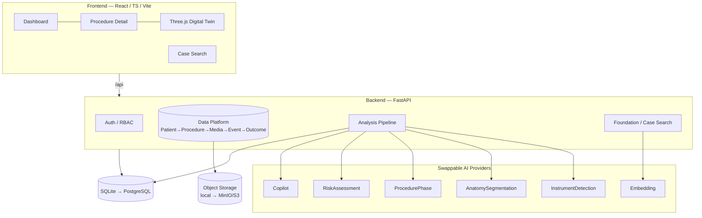
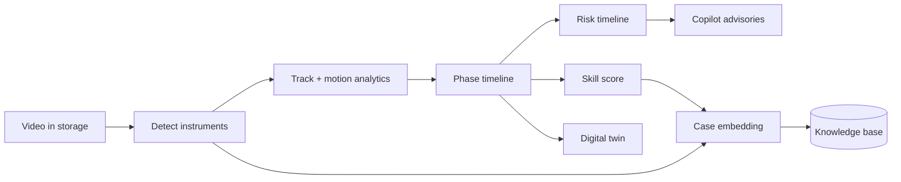

# Architecture

AdaptiveSurgeon is built **data-platform-first**: clean schemas, an event model,
and storage are the foundation every intelligence subsystem plugs into. The
durable value (per the vision) is the *data network + outcome database +
foundation model*, not any single model — so the architecture makes models
swappable and the data layer central.

## System overview



## The connected pipeline (`services/pipeline.py`)



Each subsystem consumes the previous one's output and persists results, so the
dashboard renders **one connected story** per procedure via a single
`GET /api/procedures/{id}/analysis` payload.

## Data model (Subsystem 1)

```
Patient ──< Procedure ──< Media (video / ct / mri / ...)
                 │            └──< Detection, Track
                 ├──< Event (phase | advisory | risk | complication | annotation)
                 ├──< PhaseSegment, SkillReport, RiskAssessment
                 ├──< DigitalTwin
                 ├──< CaseEmbedding
                 └──1 Outcome
```

UUID primary keys, JSON payload columns for flexibility, timestamps. All access
through SQLAlchemy so SQLite (dev) and PostgreSQL (prod) use identical code.

## Provider abstraction (the "OS" seam)

`backend/app/providers/` defines six ABCs and a config-driven registry
(`get_*_provider()`). Synthetic/heuristic implementations are the registered
defaults and always run offline. Optional real models are attempted only when
configured (env: `ADAPTIVE_INSTRUMENT_PROVIDER=yolo`, etc.) and fall back to the
synthetic provider on any import/load failure — the platform never breaks
offline.

| Interface | Default (offline) | Drop-in real model |
|-----------|-------------------|--------------------|
| InstrumentDetectionProvider | `SyntheticDetector` (HSV) | `YoloDetector` (ultralytics) |
| AnatomySegmentationProvider | `SyntheticAnatomy` | `SamSegmenter` (SAM) |
| ProcedurePhaseProvider | `HeuristicPhases` | temporal transformer |
| RiskAssessmentProvider | `RuleRisk` | trained multimodal model |
| CopilotProvider | `RuleCopilot` | LLM |
| EmbeddingProvider | `HashingTfidfEmbedder` | `SentenceTransformerEmbedder` |

## Ingestion & extensibility

Media is ingested through the object-storage interface and the relational
models — the exact path real de-identified hospital data will use. Adding real
data or real models requires **no architectural change**: implement a provider
or push records through the existing APIs.
